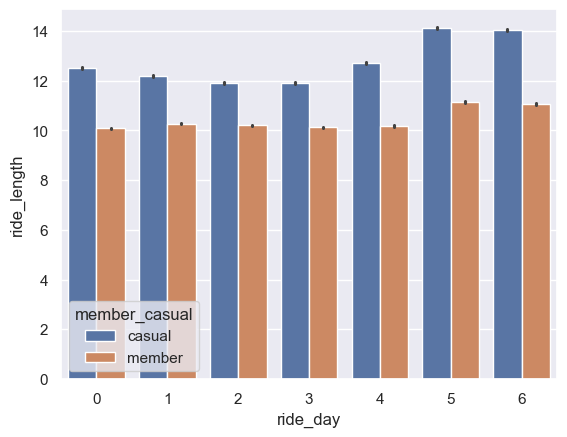
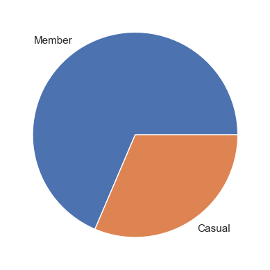
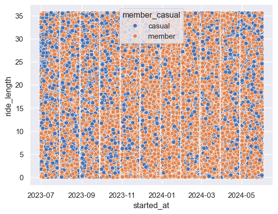
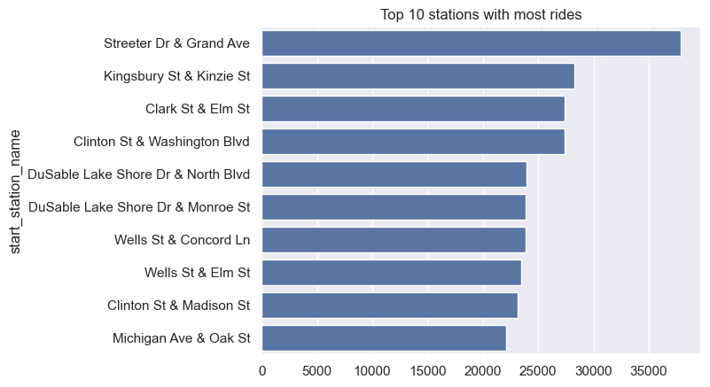
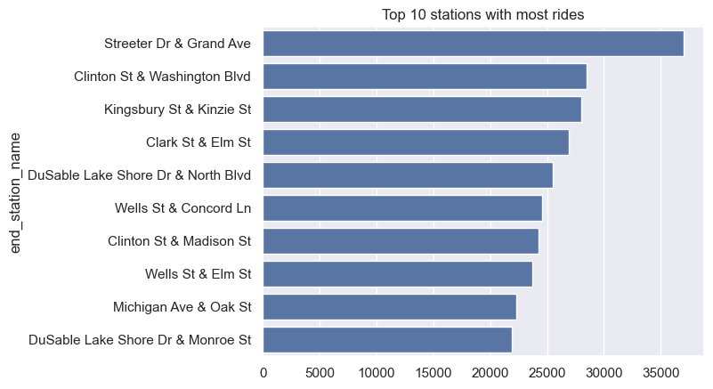
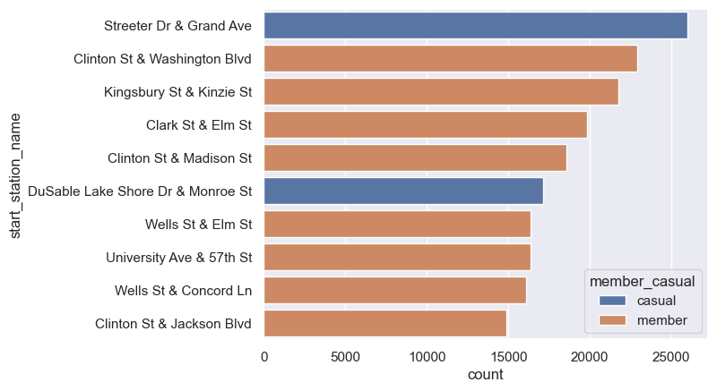
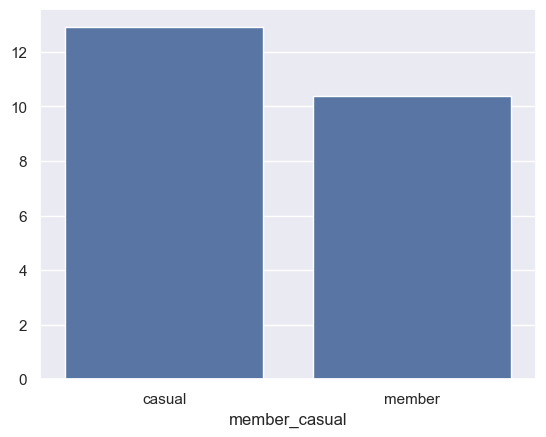
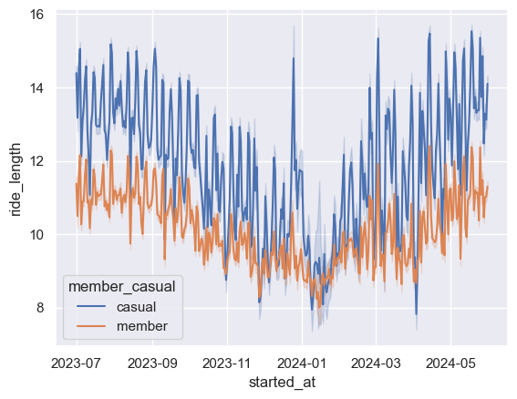
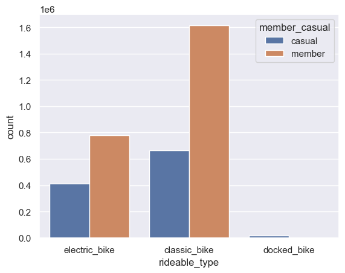

# Cyclistic Bike Share Analysis

## Introduction

## Ask

For this report, we will be focusing on one question:

-  How do annual members and casual riders use Cyclistic bikes differently?

### Library Installed
- pandas
- numpy
- seaborn
- matplotlib


```python
%pip install pandas numpy seaborn matplotlib nbconvert
```

    Requirement already satisfied: pandas in ./venv/lib/python3.12/site-packages (2.2.2)
    Requirement already satisfied: numpy in ./venv/lib/python3.12/site-packages (2.0.0)
    Requirement already satisfied: seaborn in ./venv/lib/python3.12/site-packages (0.13.2)
    Requirement already satisfied: matplotlib in ./venv/lib/python3.12/site-packages (3.9.1)
    Collecting nbconvert
      Using cached nbconvert-7.16.4-py3-none-any.whl.metadata (8.5 kB)
    Requirement already satisfied: python-dateutil>=2.8.2 in ./venv/lib/python3.12/site-packages (from pandas) (2.9.0.post0)
    Requirement already satisfied: pytz>=2020.1 in ./venv/lib/python3.12/site-packages (from pandas) (2024.1)
    Requirement already satisfied: tzdata>=2022.7 in ./venv/lib/python3.12/site-packages (from pandas) (2024.1)
    Requirement already satisfied: contourpy>=1.0.1 in ./venv/lib/python3.12/site-packages (from matplotlib) (1.2.1)
    Requirement already satisfied: cycler>=0.10 in ./venv/lib/python3.12/site-packages (from matplotlib) (0.12.1)
    Requirement already satisfied: fonttools>=4.22.0 in ./venv/lib/python3.12/site-packages (from matplotlib) (4.53.1)
    Requirement already satisfied: kiwisolver>=1.3.1 in ./venv/lib/python3.12/site-packages (from matplotlib) (1.4.5)
    Requirement already satisfied: packaging>=20.0 in ./venv/lib/python3.12/site-packages (from matplotlib) (24.1)
    Requirement already satisfied: pillow>=8 in ./venv/lib/python3.12/site-packages (from matplotlib) (10.4.0)
    Requirement already satisfied: pyparsing>=2.3.1 in ./venv/lib/python3.12/site-packages (from matplotlib) (3.1.2)
    Collecting beautifulsoup4 (from nbconvert)
      Using cached beautifulsoup4-4.12.3-py3-none-any.whl.metadata (3.8 kB)
    Collecting bleach!=5.0.0 (from nbconvert)
      Using cached bleach-6.1.0-py3-none-any.whl.metadata (30 kB)
    Collecting defusedxml (from nbconvert)
      Using cached defusedxml-0.7.1-py2.py3-none-any.whl.metadata (32 kB)
    Collecting jinja2>=3.0 (from nbconvert)
      Using cached jinja2-3.1.4-py3-none-any.whl.metadata (2.6 kB)
    Requirement already satisfied: jupyter-core>=4.7 in ./venv/lib/python3.12/site-packages (from nbconvert) (5.7.2)
    Collecting jupyterlab-pygments (from nbconvert)
      Using cached jupyterlab_pygments-0.3.0-py3-none-any.whl.metadata (4.4 kB)
    Collecting markupsafe>=2.0 (from nbconvert)
      Using cached MarkupSafe-2.1.5-cp312-cp312-macosx_10_9_universal2.whl.metadata (3.0 kB)
    Collecting mistune<4,>=2.0.3 (from nbconvert)
      Using cached mistune-3.0.2-py3-none-any.whl.metadata (1.7 kB)
    Collecting nbclient>=0.5.0 (from nbconvert)
      Using cached nbclient-0.10.0-py3-none-any.whl.metadata (7.8 kB)
    Collecting nbformat>=5.7 (from nbconvert)
      Using cached nbformat-5.10.4-py3-none-any.whl.metadata (3.6 kB)
    Collecting pandocfilters>=1.4.1 (from nbconvert)
      Using cached pandocfilters-1.5.1-py2.py3-none-any.whl.metadata (9.0 kB)
    Requirement already satisfied: pygments>=2.4.1 in ./venv/lib/python3.12/site-packages (from nbconvert) (2.18.0)
    Collecting tinycss2 (from nbconvert)
      Using cached tinycss2-1.3.0-py3-none-any.whl.metadata (3.0 kB)
    Requirement already satisfied: traitlets>=5.1 in ./venv/lib/python3.12/site-packages (from nbconvert) (5.14.3)
    Requirement already satisfied: six>=1.9.0 in ./venv/lib/python3.12/site-packages (from bleach!=5.0.0->nbconvert) (1.16.0)
    Collecting webencodings (from bleach!=5.0.0->nbconvert)
      Using cached webencodings-0.5.1-py2.py3-none-any.whl.metadata (2.1 kB)
    Requirement already satisfied: platformdirs>=2.5 in ./venv/lib/python3.12/site-packages (from jupyter-core>=4.7->nbconvert) (4.2.2)
    Requirement already satisfied: jupyter-client>=6.1.12 in ./venv/lib/python3.12/site-packages (from nbclient>=0.5.0->nbconvert) (8.6.2)
    Collecting fastjsonschema>=2.15 (from nbformat>=5.7->nbconvert)
      Using cached fastjsonschema-2.20.0-py3-none-any.whl.metadata (2.1 kB)
    Collecting jsonschema>=2.6 (from nbformat>=5.7->nbconvert)
      Using cached jsonschema-4.23.0-py3-none-any.whl.metadata (7.9 kB)
    Collecting soupsieve>1.2 (from beautifulsoup4->nbconvert)
      Using cached soupsieve-2.5-py3-none-any.whl.metadata (4.7 kB)
    Collecting attrs>=22.2.0 (from jsonschema>=2.6->nbformat>=5.7->nbconvert)
      Using cached attrs-23.2.0-py3-none-any.whl.metadata (9.5 kB)
    Collecting jsonschema-specifications>=2023.03.6 (from jsonschema>=2.6->nbformat>=5.7->nbconvert)
      Using cached jsonschema_specifications-2023.12.1-py3-none-any.whl.metadata (3.0 kB)
    Collecting referencing>=0.28.4 (from jsonschema>=2.6->nbformat>=5.7->nbconvert)
      Using cached referencing-0.35.1-py3-none-any.whl.metadata (2.8 kB)
    Collecting rpds-py>=0.7.1 (from jsonschema>=2.6->nbformat>=5.7->nbconvert)
      Using cached rpds_py-0.19.0-cp312-cp312-macosx_11_0_arm64.whl.metadata (4.1 kB)
    Requirement already satisfied: pyzmq>=23.0 in ./venv/lib/python3.12/site-packages (from jupyter-client>=6.1.12->nbclient>=0.5.0->nbconvert) (26.0.3)
    Requirement already satisfied: tornado>=6.2 in ./venv/lib/python3.12/site-packages (from jupyter-client>=6.1.12->nbclient>=0.5.0->nbconvert) (6.4.1)
    Using cached nbconvert-7.16.4-py3-none-any.whl (257 kB)
    Using cached bleach-6.1.0-py3-none-any.whl (162 kB)
    Using cached jinja2-3.1.4-py3-none-any.whl (133 kB)
    Using cached MarkupSafe-2.1.5-cp312-cp312-macosx_10_9_universal2.whl (18 kB)
    Using cached mistune-3.0.2-py3-none-any.whl (47 kB)
    Using cached nbclient-0.10.0-py3-none-any.whl (25 kB)
    Using cached nbformat-5.10.4-py3-none-any.whl (78 kB)
    Using cached pandocfilters-1.5.1-py2.py3-none-any.whl (8.7 kB)
    Using cached beautifulsoup4-4.12.3-py3-none-any.whl (147 kB)
    Using cached defusedxml-0.7.1-py2.py3-none-any.whl (25 kB)
    Using cached jupyterlab_pygments-0.3.0-py3-none-any.whl (15 kB)
    Using cached tinycss2-1.3.0-py3-none-any.whl (22 kB)
    Using cached fastjsonschema-2.20.0-py3-none-any.whl (23 kB)
    Using cached jsonschema-4.23.0-py3-none-any.whl (88 kB)
    Using cached soupsieve-2.5-py3-none-any.whl (36 kB)
    Using cached webencodings-0.5.1-py2.py3-none-any.whl (11 kB)
    Using cached attrs-23.2.0-py3-none-any.whl (60 kB)
    Using cached jsonschema_specifications-2023.12.1-py3-none-any.whl (18 kB)
    Using cached referencing-0.35.1-py3-none-any.whl (26 kB)
    Using cached rpds_py-0.19.0-cp312-cp312-macosx_11_0_arm64.whl (312 kB)
    Installing collected packages: webencodings, fastjsonschema, tinycss2, soupsieve, rpds-py, pandocfilters, mistune, markupsafe, jupyterlab-pygments, defusedxml, bleach, attrs, referencing, jinja2, beautifulsoup4, jsonschema-specifications, jsonschema, nbformat, nbclient, nbconvert
    Successfully installed attrs-23.2.0 beautifulsoup4-4.12.3 bleach-6.1.0 defusedxml-0.7.1 fastjsonschema-2.20.0 jinja2-3.1.4 jsonschema-4.23.0 jsonschema-specifications-2023.12.1 jupyterlab-pygments-0.3.0 markupsafe-2.1.5 mistune-3.0.2 nbclient-0.10.0 nbconvert-7.16.4 nbformat-5.10.4 pandocfilters-1.5.1 referencing-0.35.1 rpds-py-0.19.0 soupsieve-2.5 tinycss2-1.3.0 webencodings-0.5.1
    
    [notice] A new release of pip is available: 24.0 -> 24.1.2
    [notice] To update, run: pip install --upgrade pip
    Note: you may need to restart the kernel to use updated packages.


## Data Source (Prepare)

We gather data from [a dataset](https://divvy-tripdata.s3.amazonaws.com/index.html) about cyclistic rides. The data source schema is as follows:

- ride_id: Unique identifier for each ride
- rideable_type: Type of bike used in the ride
- started_at: Date and time the ride started
- ended_at: Date and time the ride ended
- start_station_name: Name of the start station
- start_station_id: Unique identifier for the start station
- end_station_name: Name of the end station
- end_station_id: Unique identifier for the end station
- start_lat: Latitude of the start station
- start_lng: Longitude of the start station
- end_lat: Latitude of the end station
- end_lng: Longitude of the end station
- member_casual: Indicates whether the rider is a member or casual rider

The data source is organized by an anonymyzed rider_id. This rider_id is unique to the rider themselves. As we go along, you will see how we clean the data we got from the Cyclistic data source. We use pandas to help clean up and verify the data.

To download the Cyclistic data, run the following code:


```python
# Clean up all sources from previous runs
!rm *.zip
!rm *.csv
!rm -rf __MACOSX/
# Download all sources
!wget https://divvy-tripdata.s3.amazonaws.com/202307-divvy-tripdata.zip
!wget https://divvy-tripdata.s3.amazonaws.com/202308-divvy-tripdata.zip
!wget https://divvy-tripdata.s3.amazonaws.com/202309-divvy-tripdata.zip
!wget https://divvy-tripdata.s3.amazonaws.com/202310-divvy-tripdata.zip
!wget https://divvy-tripdata.s3.amazonaws.com/202311-divvy-tripdata.zip
!wget https://divvy-tripdata.s3.amazonaws.com/202312-divvy-tripdata.zip
!wget https://divvy-tripdata.s3.amazonaws.com/202401-divvy-tripdata.zip
!wget https://divvy-tripdata.s3.amazonaws.com/202402-divvy-tripdata.zip
!wget https://divvy-tripdata.s3.amazonaws.com/202403-divvy-tripdata.zip
!wget https://divvy-tripdata.s3.amazonaws.com/202404-divvy-tripdata.zip
!wget https://divvy-tripdata.s3.amazonaws.com/202405-divvy-tripdata.zip
!wget https://divvy-tripdata.s3.amazonaws.com/202406-divvy-tripdata.zip
# Unzip all sources
!unzip 202307-divvy-tripdata.zip
!unzip 202308-divvy-tripdata.zip
!unzip 202309-divvy-tripdata.zip
!unzip 202310-divvy-tripdata.zip
!unzip 202311-divvy-tripdata.zip
!unzip 202312-divvy-tripdata.zip
!unzip 202401-divvy-tripdata.zip
!unzip 202402-divvy-tripdata.zip
!unzip 202403-divvy-tripdata.zip
!unzip 202404-divvy-tripdata.zip
!unzip 202405-divvy-tripdata.zip
!unzip 202406-divvy-tripdata.zip
```

    --2024-07-15 14:11:54--  https://divvy-tripdata.s3.amazonaws.com/202307-divvy-tripdata.zip
    Resolving divvy-tripdata.s3.amazonaws.com (divvy-tripdata.s3.amazonaws.com)... 54.231.195.137, 3.5.28.191, 3.5.28.136, ...
    Connecting to divvy-tripdata.s3.amazonaws.com (divvy-tripdata.s3.amazonaws.com)|54.231.195.137|:443... connected.
    HTTP request sent, awaiting response... 200 OK
    Length: 28544756 (27M) [application/zip]
    Saving to: ‘202307-divvy-tripdata.zip’
    
    202307-divvy-tripda 100%[===================>]  27.22M  1.21MB/s    in 23s     
    
    2024-07-15 14:12:18 (1.20 MB/s) - ‘202307-divvy-tripdata.zip’ saved [28544756/28544756]
    
    --2024-07-15 14:12:18--  https://divvy-tripdata.s3.amazonaws.com/202308-divvy-tripdata.zip
    Resolving divvy-tripdata.s3.amazonaws.com (divvy-tripdata.s3.amazonaws.com)... 54.231.235.1, 3.5.29.200, 52.217.172.129, ...
    Connecting to divvy-tripdata.s3.amazonaws.com (divvy-tripdata.s3.amazonaws.com)|54.231.235.1|:443... connected.
    HTTP request sent, awaiting response... 200 OK
    Length: 28649391 (27M) [application/zip]
    Saving to: ‘202308-divvy-tripdata.zip’
    
    202308-divvy-tripda 100%[===================>]  27.32M  1.20MB/s    in 18s     
    
    2024-07-15 14:12:36 (1.54 MB/s) - ‘202308-divvy-tripdata.zip’ saved [28649391/28649391]
    
    --2024-07-15 14:12:37--  https://divvy-tripdata.s3.amazonaws.com/202309-divvy-tripdata.zip
    Resolving divvy-tripdata.s3.amazonaws.com (divvy-tripdata.s3.amazonaws.com)... 3.5.22.225, 16.182.36.57, 3.5.28.241, ...
    Connecting to divvy-tripdata.s3.amazonaws.com (divvy-tripdata.s3.amazonaws.com)|3.5.22.225|:443... connected.
    HTTP request sent, awaiting response... 200 OK
    Length: 24894104 (24M) [application/zip]
    Saving to: ‘202309-divvy-tripdata.zip’
    
    202309-divvy-tripda 100%[===================>]  23.74M  6.70MB/s    in 3.7s    
    
    2024-07-15 14:12:41 (6.44 MB/s) - ‘202309-divvy-tripdata.zip’ saved [24894104/24894104]
    
    --2024-07-15 14:12:41--  https://divvy-tripdata.s3.amazonaws.com/202310-divvy-tripdata.zip
    Resolving divvy-tripdata.s3.amazonaws.com (divvy-tripdata.s3.amazonaws.com)... 3.5.3.11, 16.182.36.57, 3.5.28.241, ...
    Connecting to divvy-tripdata.s3.amazonaws.com (divvy-tripdata.s3.amazonaws.com)|3.5.3.11|:443... connected.
    HTTP request sent, awaiting response... 200 OK
    Length: 19145928 (18M) [application/zip]
    Saving to: ‘202310-divvy-tripdata.zip’
    
    202310-divvy-tripda 100%[===================>]  18.26M  1.68MB/s    in 11s     
    
    2024-07-15 14:12:53 (1.64 MB/s) - ‘202310-divvy-tripdata.zip’ saved [19145928/19145928]
    
    --2024-07-15 14:12:53--  https://divvy-tripdata.s3.amazonaws.com/202311-divvy-tripdata.zip
    Resolving divvy-tripdata.s3.amazonaws.com (divvy-tripdata.s3.amazonaws.com)... 52.216.136.212, 52.216.200.243, 52.216.25.172, ...
    Connecting to divvy-tripdata.s3.amazonaws.com (divvy-tripdata.s3.amazonaws.com)|52.216.136.212|:443... connected.
    HTTP request sent, awaiting response... 200 OK
    Length: 13165411 (13M) [application/zip]
    Saving to: ‘202311-divvy-tripdata.zip’
    
    202311-divvy-tripda 100%[===================>]  12.55M  1.88MB/s    in 4.9s    
    
    2024-07-15 14:12:58 (2.56 MB/s) - ‘202311-divvy-tripdata.zip’ saved [13165411/13165411]
    
    --2024-07-15 14:12:59--  https://divvy-tripdata.s3.amazonaws.com/202312-divvy-tripdata.zip
    Resolving divvy-tripdata.s3.amazonaws.com (divvy-tripdata.s3.amazonaws.com)... 52.217.108.196, 52.216.200.243, 52.216.25.172, ...
    Connecting to divvy-tripdata.s3.amazonaws.com (divvy-tripdata.s3.amazonaws.com)|52.217.108.196|:443... connected.
    HTTP request sent, awaiting response... 200 OK
    Length: 8419815 (8.0M) [application/zip]
    Saving to: ‘202312-divvy-tripdata.zip’
    
    202312-divvy-tripda 100%[===================>]   8.03M  3.19MB/s    in 2.5s    
    
    2024-07-15 14:13:02 (3.19 MB/s) - ‘202312-divvy-tripdata.zip’ saved [8419815/8419815]
    
    --2024-07-15 14:13:02--  https://divvy-tripdata.s3.amazonaws.com/202401-divvy-tripdata.zip
    Resolving divvy-tripdata.s3.amazonaws.com (divvy-tripdata.s3.amazonaws.com)... 16.182.72.241, 52.216.200.243, 3.5.30.163, ...
    Connecting to divvy-tripdata.s3.amazonaws.com (divvy-tripdata.s3.amazonaws.com)|16.182.72.241|:443... connected.
    HTTP request sent, awaiting response... 200 OK
    Length: 5450495 (5.2M) [application/zip]
    Saving to: ‘202401-divvy-tripdata.zip’
    
    202401-divvy-tripda 100%[===================>]   5.20M  6.14MB/s    in 0.8s    
    
    2024-07-15 14:13:03 (6.14 MB/s) - ‘202401-divvy-tripdata.zip’ saved [5450495/5450495]
    
    --2024-07-15 14:13:04--  https://divvy-tripdata.s3.amazonaws.com/202402-divvy-tripdata.zip
    Resolving divvy-tripdata.s3.amazonaws.com (divvy-tripdata.s3.amazonaws.com)... 52.217.114.97, 52.216.200.243, 3.5.30.163, ...
    Connecting to divvy-tripdata.s3.amazonaws.com (divvy-tripdata.s3.amazonaws.com)|52.217.114.97|:443... connected.
    HTTP request sent, awaiting response... 200 OK
    Length: 8455339 (8.1M) [application/zip]
    Saving to: ‘202402-divvy-tripdata.zip’
    
    202402-divvy-tripda 100%[===================>]   8.06M  1022KB/s    in 8.6s    
    
    2024-07-15 14:13:13 (958 KB/s) - ‘202402-divvy-tripdata.zip’ saved [8455339/8455339]
    
    --2024-07-15 14:13:13--  https://divvy-tripdata.s3.amazonaws.com/202403-divvy-tripdata.zip
    Resolving divvy-tripdata.s3.amazonaws.com (divvy-tripdata.s3.amazonaws.com)... 52.217.33.196, 3.5.10.213, 52.217.230.161, ...
    Connecting to divvy-tripdata.s3.amazonaws.com (divvy-tripdata.s3.amazonaws.com)|52.217.33.196|:443... connected.
    HTTP request sent, awaiting response... 200 OK
    Length: 10964676 (10M) [application/zip]
    Saving to: ‘202403-divvy-tripdata.zip’
    
    202403-divvy-tripda 100%[===================>]  10.46M  1.65MB/s    in 5.6s    
    
    2024-07-15 14:13:19 (1.87 MB/s) - ‘202403-divvy-tripdata.zip’ saved [10964676/10964676]
    
    --2024-07-15 14:13:19--  https://divvy-tripdata.s3.amazonaws.com/202404-divvy-tripdata.zip
    Resolving divvy-tripdata.s3.amazonaws.com (divvy-tripdata.s3.amazonaws.com)... 52.217.70.108, 3.5.10.213, 52.217.230.161, ...
    Connecting to divvy-tripdata.s3.amazonaws.com (divvy-tripdata.s3.amazonaws.com)|52.217.70.108|:443... connected.
    HTTP request sent, awaiting response... 200 OK
    Length: 15413128 (15M) [application/zip]
    Saving to: ‘202404-divvy-tripdata.zip’
    
    202404-divvy-tripda 100%[===================>]  14.70M  7.56MB/s    in 1.9s    
    
    2024-07-15 14:13:22 (7.56 MB/s) - ‘202404-divvy-tripdata.zip’ saved [15413128/15413128]
    
    --2024-07-15 14:13:22--  https://divvy-tripdata.s3.amazonaws.com/202405-divvy-tripdata.zip
    Resolving divvy-tripdata.s3.amazonaws.com (divvy-tripdata.s3.amazonaws.com)... 54.231.137.161, 3.5.10.213, 3.5.27.214, ...
    Connecting to divvy-tripdata.s3.amazonaws.com (divvy-tripdata.s3.amazonaws.com)|54.231.137.161|:443... connected.
    HTTP request sent, awaiting response... 200 OK
    Length: 22817320 (22M) [binary/octet-stream]
    Saving to: ‘202405-divvy-tripdata.zip’
    
    202405-divvy-tripda 100%[===================>]  21.76M   933KB/s    in 10s     
    
    2024-07-15 14:13:33 (2.07 MB/s) - ‘202405-divvy-tripdata.zip’ saved [22817320/22817320]
    
    --2024-07-15 14:13:33--  https://divvy-tripdata.s3.amazonaws.com/202406-divvy-tripdata.zip
    Resolving divvy-tripdata.s3.amazonaws.com (divvy-tripdata.s3.amazonaws.com)... 16.182.98.33, 3.5.30.46, 52.216.56.17, ...
    Connecting to divvy-tripdata.s3.amazonaws.com (divvy-tripdata.s3.amazonaws.com)|16.182.98.33|:443... connected.
    HTTP request sent, awaiting response... 200 OK
    Length: 28816235 (27M) [application/zip]
    Saving to: ‘202406-divvy-tripdata.zip’
    
    202406-divvy-tripda 100%[===================>]  27.48M  1.25MB/s    in 22s     
    
    2024-07-15 14:13:56 (1.24 MB/s) - ‘202406-divvy-tripdata.zip’ saved [28816235/28816235]
    
    Archive:  202307-divvy-tripdata.zip
      inflating: 202307-divvy-tripdata.csv  
      inflating: __MACOSX/._202307-divvy-tripdata.csv  
    Archive:  202308-divvy-tripdata.zip
      inflating: 202308-divvy-tripdata.csv  
      inflating: __MACOSX/._202308-divvy-tripdata.csv  
    Archive:  202309-divvy-tripdata.zip
      inflating: 202309-divvy-tripdata.csv  
      inflating: __MACOSX/._202309-divvy-tripdata.csv  
    Archive:  202310-divvy-tripdata.zip
      inflating: 202310-divvy-tripdata.csv  
      inflating: __MACOSX/._202310-divvy-tripdata.csv  
    Archive:  202311-divvy-tripdata.zip
      inflating: 202311-divvy-tripdata.csv  
      inflating: __MACOSX/._202311-divvy-tripdata.csv  
    Archive:  202312-divvy-tripdata.zip
      inflating: 202312-divvy-tripdata.csv  
      inflating: __MACOSX/._202312-divvy-tripdata.csv  
    Archive:  202401-divvy-tripdata.zip
      inflating: 202401-divvy-tripdata.csv  
      inflating: __MACOSX/._202401-divvy-tripdata.csv  
    Archive:  202402-divvy-tripdata.zip
      inflating: 202402-divvy-tripdata.csv  
      inflating: __MACOSX/._202402-divvy-tripdata.csv  
    Archive:  202403-divvy-tripdata.zip
      inflating: 202403-divvy-tripdata.csv  
      inflating: __MACOSX/._202403-divvy-tripdata.csv  
    Archive:  202404-divvy-tripdata.zip
      inflating: 202404-divvy-tripdata.csv  
      inflating: __MACOSX/._202404-divvy-tripdata.csv  
    Archive:  202405-divvy-tripdata.zip
      inflating: 202405-divvy-tripdata.csv  
      inflating: __MACOSX/._202405-divvy-tripdata.csv  
    Archive:  202406-divvy-tripdata.zip
      inflating: 202406-divvy-tripdata.csv  
      inflating: __MACOSX/._202406-divvy-tripdata.csv  


Now that we have downloaded all our data sources, we will start loading them into data frames.

## Data Loading and Cleanup (Process)

The first thing we need to do is import our libraries that we will be using. In our case, we will be using pandas, numpy, seaborn, and matplotlib. Pandas and numpy are data management tools while seaborn and matplotlib are data visualization tools. 


```python
import pandas as pd
import numpy as np

import seaborn as sns
import matplotlib.pyplot as plt

sns.set_theme()
```

Once imported, we will focus our attention on the Cyclistic data. We will be using the Cyclistic data from 2023-07 to 2024-06 to cover a year's worth of data. Each data frame contains one months worth of anonymized ride data from Cyclistic. We load all our trip data into it's own data frame. 


```python
trip_data_202307 = pd.read_csv('202307-divvy-tripdata.csv')
trip_data_202308 = pd.read_csv('202308-divvy-tripdata.csv')
trip_data_202309 = pd.read_csv('202309-divvy-tripdata.csv')
trip_data_202310 = pd.read_csv('202310-divvy-tripdata.csv')
trip_data_202311 = pd.read_csv('202311-divvy-tripdata.csv')
trip_data_202312 = pd.read_csv('202312-divvy-tripdata.csv')
trip_data_202401 = pd.read_csv('202401-divvy-tripdata.csv')
trip_data_202402 = pd.read_csv('202402-divvy-tripdata.csv')
trip_data_202403 = pd.read_csv('202403-divvy-tripdata.csv')
trip_data_202404 = pd.read_csv('202404-divvy-tripdata.csv')
trip_data_202405 = pd.read_csv('202405-divvy-tripdata.csv')
trip_data_202406 = pd.read_csv('202406-divvy-tripdata.csv')
```

Next, we want to merge all our trip data into one data frame. This data frame will be called `df`. First, we load all the data. Then we reset the index inplace (LOC 5). Once done, we convert the `started_at` and `ended_at` columns to datetime objects, then convert `member_casual` into a category. The rest of the columns will be converted to string objects with the exception of our long/lat fields. They will stay floats.


```python
df = pd.concat(
    [trip_data_202307, trip_data_202308, trip_data_202309, trip_data_202310, trip_data_202311, trip_data_202312,
     trip_data_202401, trip_data_202402, trip_data_202403, trip_data_202404, trip_data_202405, trip_data_202406])

df.reset_index(inplace=True)

df['started_at'] = pd.to_datetime(df['started_at'], errors='coerce')
df['ended_at'] = pd.to_datetime(df['ended_at'], errors='coerce')
df['member_casual'] = df['member_casual'].astype('category')
df['ride_id'] = df['ride_id'].astype('string')
df['rideable_type'] = df['rideable_type'].astype('string')
df['start_station_name'] = df['start_station_name'].astype('string')
df['start_station_id'] = df['start_station_id'].astype('string')
df['end_station_name'] = df['end_station_name'].astype('string')
df['end_station_id'] = df['end_station_id'].astype('string')

df.head()
```


<div>
<style scoped>
    .dataframe tbody tr th:only-of-type {
        vertical-align: middle;
    }

    .dataframe tbody tr th {
        vertical-align: top;
    }

    .dataframe thead th {
        text-align: right;
    }
</style>
<table border="1" class="dataframe">
  <thead>
    <tr style="text-align: right;">
      <th></th>
      <th>index</th>
      <th>ride_id</th>
      <th>rideable_type</th>
      <th>started_at</th>
      <th>ended_at</th>
      <th>start_station_name</th>
      <th>start_station_id</th>
      <th>end_station_name</th>
      <th>end_station_id</th>
      <th>start_lat</th>
      <th>start_lng</th>
      <th>end_lat</th>
      <th>end_lng</th>
      <th>member_casual</th>
    </tr>
  </thead>
  <tbody>
    <tr>
      <th>0</th>
      <td>0</td>
      <td>9340B064F0AEE130</td>
      <td>electric_bike</td>
      <td>2023-07-23 20:06:14</td>
      <td>2023-07-23 20:22:44</td>
      <td>Kedzie Ave &amp; 110th St</td>
      <td>20204</td>
      <td>Public Rack - Racine Ave &amp; 109th Pl</td>
      <td>877</td>
      <td>41.692406</td>
      <td>-87.700905</td>
      <td>41.694835</td>
      <td>-87.653041</td>
      <td>member</td>
    </tr>
    <tr>
      <th>1</th>
      <td>1</td>
      <td>D1460EE3CE0D8AF8</td>
      <td>classic_bike</td>
      <td>2023-07-23 17:05:07</td>
      <td>2023-07-23 17:18:37</td>
      <td>Western Ave &amp; Walton St</td>
      <td>KA1504000103</td>
      <td>Milwaukee Ave &amp; Grand Ave</td>
      <td>13033</td>
      <td>41.898418</td>
      <td>-87.686596</td>
      <td>41.891578</td>
      <td>-87.648384</td>
      <td>member</td>
    </tr>
    <tr>
      <th>2</th>
      <td>2</td>
      <td>DF41BE31B895A25E</td>
      <td>classic_bike</td>
      <td>2023-07-23 10:14:53</td>
      <td>2023-07-23 10:24:29</td>
      <td>Western Ave &amp; Walton St</td>
      <td>KA1504000103</td>
      <td>Damen Ave &amp; Pierce Ave</td>
      <td>TA1305000041</td>
      <td>41.898418</td>
      <td>-87.686596</td>
      <td>41.909396</td>
      <td>-87.677692</td>
      <td>member</td>
    </tr>
    <tr>
      <th>3</th>
      <td>3</td>
      <td>9624A293749EF703</td>
      <td>electric_bike</td>
      <td>2023-07-21 08:27:44</td>
      <td>2023-07-21 08:32:40</td>
      <td>Racine Ave &amp; Randolph St</td>
      <td>13155</td>
      <td>Clinton St &amp; Madison St</td>
      <td>TA1305000032</td>
      <td>41.884112</td>
      <td>-87.656943</td>
      <td>41.882752</td>
      <td>-87.641190</td>
      <td>member</td>
    </tr>
    <tr>
      <th>4</th>
      <td>4</td>
      <td>2F68A6A4CDB4C99A</td>
      <td>classic_bike</td>
      <td>2023-07-08 15:46:42</td>
      <td>2023-07-08 15:58:08</td>
      <td>Clark St &amp; Leland Ave</td>
      <td>TA1309000014</td>
      <td>Montrose Harbor</td>
      <td>TA1308000012</td>
      <td>41.967088</td>
      <td>-87.667291</td>
      <td>41.963982</td>
      <td>-87.638181</td>
      <td>member</td>
    </tr>
  </tbody>
</table>
</div>


Now that we have a data frame that is ready for analysis, we will drop all rows with null values and duplicate rows. This will reduce our row count to just reliable data.


```python
df.drop_duplicates(inplace=True)
df.dropna(inplace=True)

df.count()
```


    index                 3780022
    ride_id               3780022
    rideable_type         3780022
    started_at            3780022
    ended_at              3780022
    start_station_name    3780022
    start_station_id      3780022
    end_station_name      3780022
    end_station_id        3780022
    start_lat             3780022
    start_lng             3780022
    end_lat               3780022
    end_lng               3780022
    member_casual         3780022
    dtype: int64


Now that we have the basics in for cleaning, we will add some new columns to our data frame to help us analyze our data.

- `ride_length`: The length of the ride in minutes
- `ride_day`: The day of the week the ride started
- `ride_hour`: The hour of the day the ride started
- `ride_month`: The month of the year the ride started
- `start_time`: The time of the day the ride started
- `end_time`: The time of the day the ride ended


```python
df['ride_length'] = (df['ended_at'] - df['started_at']) / \
    np.timedelta64(1, 'm')
df['ride_day'] = df['started_at'].dt.dayofweek
df['ride_hour'] = df['started_at'].dt.hour
df['ride_month'] = df['started_at'].dt.month
df['start_time'] = df['started_at'].dt.time
df['end_time'] = df['ended_at'].dt.time
```

OK, now we need to find our outliers and drop them. We will be using the [IQR method](https://en.wikipedia.org/wiki/Interquartile_range) to identify outliers.


```python
# Calculate the IQR
Q1 = df['ride_length'].quantile(0.25)
Q3 = df['ride_length'].quantile(0.75)
IQR = Q3 - Q1

# Define the lower and upper bounds for outliers
lower_bound = Q1 - 1.5 * IQR
upper_bound = Q3 + 1.5 * IQR

# Filter out outliers
df = df[(df['ride_length'] >= lower_bound) & (df['ride_length'] <= upper_bound)]

# Print the new shape of the DataFrame
print(df.shape)
print(df.count())
```

    (3488744, 20)
    index                 3488744
    ride_id               3488744
    rideable_type         3488744
    started_at            3488744
    ended_at              3488744
    start_station_name    3488744
    start_station_id      3488744
    end_station_name      3488744
    end_station_id        3488744
    start_lat             3488744
    start_lng             3488744
    end_lat               3488744
    end_lng               3488744
    member_casual         3488744
    ride_length           3488744
    ride_day              3488744
    ride_hour             3488744
    ride_month            3488744
    start_time            3488744
    end_time              3488744
    dtype: int64


Now that we have outliers out, we will analyze our data.

## Analysis of data

The first thing we want to ask ourselves is how are members and casuals using Cyclistic? What is the main difference between them?

To check this out, we need to count the number of rides for each member type and display the results as a bar chart.


```python
sns.barplot(
    df,
    x="ride_day",
    y="ride_length",
    hue="member_casual",
    estimator=np.mean
)
plt.show()
```


    

    


As you can see, casuals take longer rides than other members, with the number of members who ride being almost consistent, with casuals riding a lot during the weekends. We can deduce that casuals ride longer than members, and their ride lengths are longer during weekends while member ride lengths stay almost steady.

Truth 1: Casuals ride longer than members
Truth 2: Casuals ride longer during weekends

Now, let's look at the average total rides per member and casual. This will help us understand how the casuals and members different in usage. 


```python
total_rides = df['ride_id'].count()
total_rides_member = df[df['member_casual'] == 'member']['ride_id'].count()
print("Average rides per member: ", total_rides_member)
print("Percentage of rides that were from members", total_rides_member / total_rides * 100)
total_rides_casual = df[df['member_casual'] == 'casual']['ride_id'].count()
print("Average rides per casual: ", total_rides_casual)
print("Percentage of rides that were from casuals",
      total_rides_casual / total_rides * 100)

plt.pie(x=[total_rides_member, total_rides_casual], labels=["Member", "Casual"])
plt.show()
```

    Average rides per member:  2392758
    Percentage of rides that were from members 68.58508391558681
    Average rides per casual:  1095986
    Percentage of rides that were from casuals 31.414916084413186


    

    


Members account for 69% of all rides. Casuals account for 31% of all rides. So, members account for more rides than casuals. They are trying to get their money's worth. Now, let's look at the average ride length per member and casual. We will be using a line plot to visualize this. 


```python
df_filtered = df[(df['ride_length'] >= 0) & (df['ride_length'] <= 60)]
sns.scatterplot(df_filtered, x="started_at", y="ride_length", hue="member_casual")
plt.show()

```

    /Users/ejmatta/github.com/ematta/cyclistic/venv/lib/python3.12/site-packages/IPython/core/pylabtools.py:170: UserWarning: Creating legend with loc="best" can be slow with large amounts of data.
      fig.canvas.print_figure(bytes_io, **kw)


    

    


This scatter plit shows more casuals than members, meaning that there is a possibility that members get their bikes at a precise time.

Let's look deeper into days of the week and their meaning to member/casual usage.


```python
day_with_most_ride_casual = df_filtered[df_filtered['member_casual'] == 'casual']['ride_day'].value_counts().idxmax()
print("Day with most ride for casual (0-Sunday) is: ", day_with_most_ride_casual, " day of the week")
day_with_most_ride_member = df_filtered[df_filtered['member_casual'] == 'member']['ride_day'].value_counts().idxmax()
print("Day with most ride for member (0-Sunday) is: ", day_with_most_ride_member, " day of the week")
```

    Day with most ride for casual (0-Sunday) is:  5  day of the week
    Day with most ride for member (0-Sunday) is:  2  day of the week


Casuals ride more towards the end of the week vs members, who start towards the begining. I suspect this might be due to workers vs weekenders. 


```python
# Top 10 stations with most rides grouped by member_casual
top_10_stations = df['start_station_name'].value_counts().head(10)
sns.barplot(y=top_10_stations.index, x=top_10_stations.values).set_title('Top 10 stations with most rides')
plt.show()
```


    

    


Now let's look at the top 10 stations end stations.


```python
# Top 10 stations with most rides grouped by member_casual
top_10_stations = df['end_station_name'].value_counts().head(10)
sns.barplot(y=top_10_stations.index, x=top_10_stations.values).set_title('Top 10 stations with most rides')
plt.show()
```


    

    


We see that Streeter Dr. & Grand Ave is the top station for pickups AND dropoffs. Now, lets dive into how this will look like per casual vs member.


```python
top_10_stations = df.groupby(['start_station_name', 'member_casual']).size().reset_index(name='count').nlargest(10, 'count')
sns.barplot(y=top_10_stations['start_station_name'], x=top_10_stations['count'], hue=top_10_stations['member_casual'])
plt.show()
top_10_stations
```

    /var/folders/0z/s8q5j9sj52s90llyhn7nhj5m0000gn/T/ipykernel_46586/3672804663.py:1: FutureWarning: The default of observed=False is deprecated and will be changed to True in a future version of pandas. Pass observed=False to retain current behavior or observed=True to adopt the future default and silence this warning.
      top_10_stations = df.groupby(['start_station_name', 'member_casual']).size().reset_index(name='count').nlargest(10, 'count')


    

    


<div>
<style scoped>
    .dataframe tbody tr th:only-of-type {
        vertical-align: middle;
    }

    .dataframe tbody tr th {
        vertical-align: top;
    }

    .dataframe thead th {
        text-align: right;
    }
</style>
<table border="1" class="dataframe">
  <thead>
    <tr style="text-align: right;">
      <th></th>
      <th>start_station_name</th>
      <th>member_casual</th>
      <th>count</th>
    </tr>
  </thead>
  <tbody>
    <tr>
      <th>2896</th>
      <td>Streeter Dr &amp; Grand Ave</td>
      <td>casual</td>
      <td>25958</td>
    </tr>
    <tr>
      <th>407</th>
      <td>Clinton St &amp; Washington Blvd</td>
      <td>member</td>
      <td>22902</td>
    </tr>
    <tr>
      <th>943</th>
      <td>Kingsbury St &amp; Kinzie St</td>
      <td>member</td>
      <td>21770</td>
    </tr>
    <tr>
      <th>353</th>
      <td>Clark St &amp; Elm St</td>
      <td>member</td>
      <td>19849</td>
    </tr>
    <tr>
      <th>399</th>
      <td>Clinton St &amp; Madison St</td>
      <td>member</td>
      <td>18568</td>
    </tr>
    <tr>
      <th>552</th>
      <td>DuSable Lake Shore Dr &amp; Monroe St</td>
      <td>casual</td>
      <td>17138</td>
    </tr>
    <tr>
      <th>3007</th>
      <td>Wells St &amp; Elm St</td>
      <td>member</td>
      <td>16387</td>
    </tr>
    <tr>
      <th>2933</th>
      <td>University Ave &amp; 57th St</td>
      <td>member</td>
      <td>16367</td>
    </tr>
    <tr>
      <th>3005</th>
      <td>Wells St &amp; Concord Ln</td>
      <td>member</td>
      <td>16109</td>
    </tr>
    <tr>
      <th>395</th>
      <td>Clinton St &amp; Jackson Blvd</td>
      <td>member</td>
      <td>14865</td>
    </tr>
  </tbody>
</table>
</div>


Next, let's look at average ride length per member and casual.


```python
# Average ride length group by member_casual
average_ride_length = df.groupby('member_casual')['ride_length'].mean()
sns.barplot(x=average_ride_length.index, y=average_ride_length.values)
plt.show()
```

    /var/folders/0z/s8q5j9sj52s90llyhn7nhj5m0000gn/T/ipykernel_46586/2637878551.py:2: FutureWarning: The default of observed=False is deprecated and will be changed to True in a future version of pandas. Pass observed=False to retain current behavior or observed=True to adopt the future default and silence this warning.
      average_ride_length = df.groupby('member_casual')['ride_length'].mean()


    

    


```python
# Line graph of ride_length by started_at date grouped by member_casual
sns.lineplot(x=df['started_at'].dt.date, y=df['ride_length'], hue=df['member_casual'])
plt.show()
```


    

    


There are a couple of things we can extrapolate from this data. During winter time, there are lower casual rides than other times of the year. Our lowest dip is in Janurary. However, we do see that members have a higher average ride length than casuals.

Now, let's look at member_casual to rideable_type.


```python
# bar plot of a count of ride types by member_casual
sns.countplot(x=df['rideable_type'], hue=df['member_casual'])
plt.show()
```


    

    


As you can see, both casuals and members use the classic bike type most. The docked_bike type is exclusively used by members.

## What to do?

1. Weekend activity is important to our casual users, so let's focus on selling weekend packages. This will help ensure that we can convert casual users to member users. By creating a weekend only pass, we might be able to convert these folks and introduce a lower-priced tier for introduction.
2. Membership benefits around weekend events, as well as introducing pay-as-you-ride packages. Some of our casuals might not like a monthly fee, and they might find a flat fee conflicting with how they use the product. By introducing a pay-as-you-ride scheme, we can provide a lower price for our casuals. Longer riders can pay, but the benefits of membership looks more appealing the further they ride.
3. Introduce seasonal prices, where we can offer lower fares during winter months. This should entice folks to ride with us during low dips in usage.


